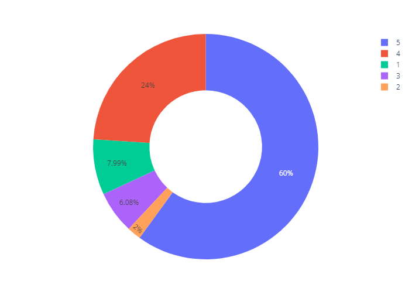
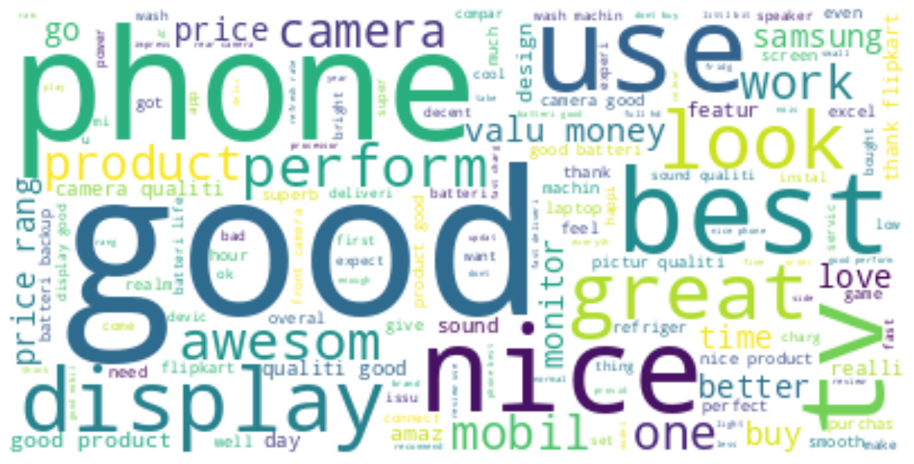

# Sentiment Analysis

## **Description:**

This project is equiped with essential skils in data science using Python, focuing onf libraries such as NumPy, Pandas, Matplotlib to analyze sentiment in online shopping reviews. The process involves cleaning and classifying the reviews into three main cateories as

- **"Positive"**,
- **"Negative"**, or
- **"Neutral"** sentiments,
  providing valuable insights for consumers and businesses.

## **Key Learning Areas:**

1. Exploratory Data Analysis (EDA)
2. Collect and preprocess data from e-com reviews.
3. Text analysis and sentiment classification.
4. Generate effective visualizations.
5. Recommendations based on sentiment analysis results.

This project allows you to apply knowledge gained during the internship to a real-world data science scenario, showcasing your abilities as a data scientist.

## Visualizations

## Tech Stack:

- **NumPy**
- **Pandas**
- Data visualization libraries like **Matplotlib**.
